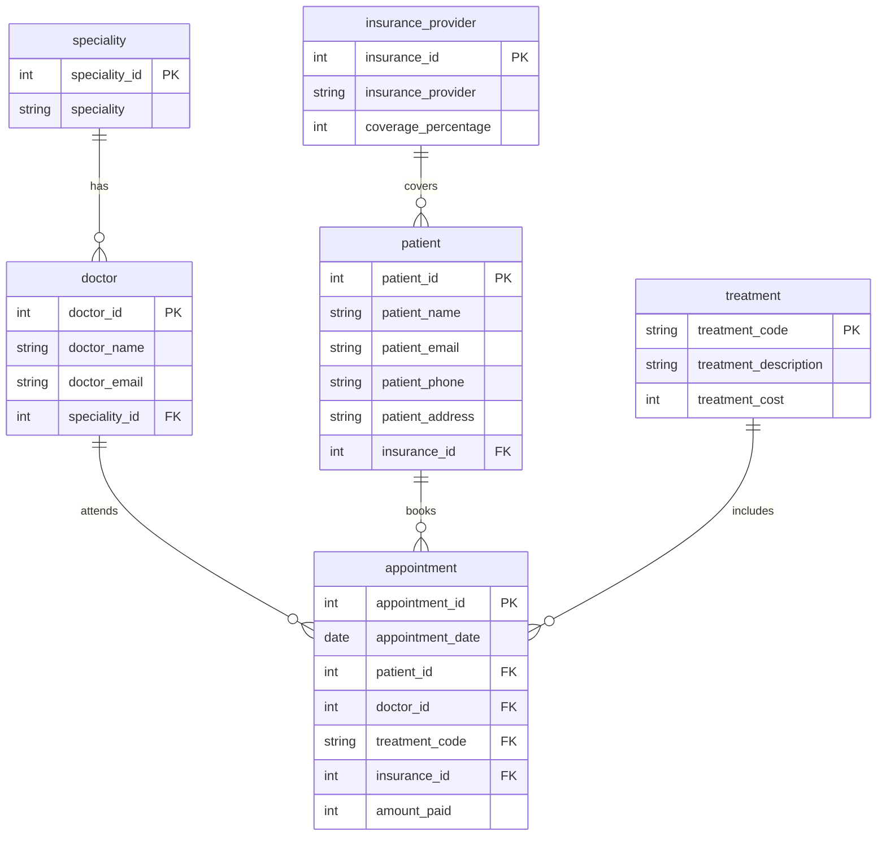
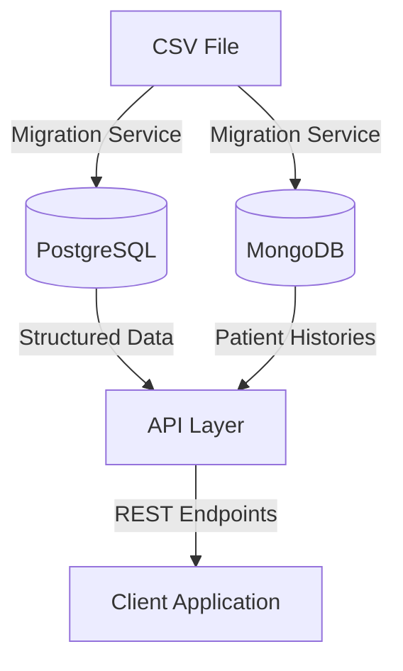

# SaludPlus API

## Project Overview
The **SaludPlus API** is a hybrid persistence architecture designed to manage the data of a growing healthcare network. It combines the strengths of relational databases (PostgreSQL) for structured data and NoSQL databases (MongoDB) for semi-structured data, ensuring scalability, consistency, and performance.

### Features
- **Doctors Management**: List, retrieve, and update doctor information.
- **Patient Histories**: Retrieve complete patient histories with embedded appointment data.
- **Revenue Reports**: Generate financial reports grouped by insurance providers.
- **Data Migration**: Normalize and distribute data from CSV files into PostgreSQL and MongoDB.

---

## Architecture Decisions

### Hybrid Persistence Justification
- **SQL (PostgreSQL)**:
  - Used for structured data requiring strict relationships and constraints (e.g., doctors, patients, appointments).
  - Ensures data integrity with ACID compliance.
- **NoSQL (MongoDB)**:
  - Used for patient histories, optimized for fast reads and flexible schema.
  - Embedding appointment data avoids costly joins.

### Normalization in PostgreSQL
- **1NF**: Removed repeating groups by creating separate tables for doctors, patients, and appointments.
- **2NF**: Eliminated partial dependencies by linking tables through foreign keys.
- **3NF**: Removed transitive dependencies by separating insurance providers and specialties.

### MongoDB Document Design
- **Embedding**: Patient histories include all appointments as embedded documents.
- **Indexes**: Created on `patientEmail` for fast lookups.

---

## Database Schemas

### PostgreSQL Schema
#### Tables
- **speciality**: Stores medical specialties.
- **insurance_provider**: Stores insurance providers and coverage percentages.
- **doctor**: Stores doctor information, linked to specialties.
- **patient**: Stores patient information, linked to insurance providers.
- **treatment**: Stores treatment codes, descriptions, and costs.
- **appointment**: Stores appointment details, linking patients, doctors, and treatments.

### Entity-Relationship Diagram (PostgreSQL)


### MongoDB Schema
#### Collection: `patient_histories`
```json
{
  "patientEmail": "example@mail.com",
  "patientName": "John Doe",
  "appointments": [
    {
      "appointmentId": "APT-1001",
      "date": "2024-01-07",
      "doctorName": "Dr. Smith",
      "specialty": "Cardiology",
      "treatmentCode": "TRT-001",
      "treatmentDescription": "Heart Checkup",
      "treatmentCost": 200,
      "insuranceProvider": "HealthCare Inc.",
      "coveragePercentage": 80,
      "amountPaid": 160
    }
  ]
}
```

---

## API Documentation

### Endpoints

#### Doctors
1. **List Doctors**
   - **GET** `/api/doctors`
   - **Query Params**: `specialty` (optional)
   - **Response**:
     ```json
     {
       "ok": true,
       "doctors": [
         {
           "id": 1,
           "name": "Dr. Smith",
           "email": "smith@mail.com",
           "specialty": "Cardiology"
         }
       ]
     }
     ```

2. **Get Doctor by ID**
   - **GET** `/api/doctors/:id`
   - **Response**:
     ```json
     {
       "ok": true,
       "doctor": {
         "id": 1,
         "name": "Dr. Smith",
         "email": "smith@mail.com",
         "specialty": "Cardiology"
       }
     }
     ```

3. **Update Doctor**
   - **PUT** `/api/doctors/:id`
   - **Body**:
     ```json
     {
       "name": "Dr. John Smith",
       "email": "john.smith@mail.com",
       "specialty": "Cardiology"
     }
     ```
   - **Response**:
     ```json
     {
       "ok": true,
       "message": "Doctor updated successfully",
       "doctor": { ... }
     }
     ```

#### Patients
1. **Get Patient History**
   - **GET** `/api/patients/:email/history`
   - **Response**:
     ```json
     {
       "ok": true,
       "patient": {
         "email": "example@mail.com",
         "name": "John Doe",
         "appointments": [ ... ]
       },
       "summary": {
         "totalAppointments": 5,
         "totalSpent": 1000,
         "mostFrequentSpecialty": "Cardiology"
       }
     }
     ```

#### Reports
1. **Revenue Report**
   - **GET** `/api/reports/revenue`
   - **Query Params**: `startDate`, `endDate` (optional)
   - **Response**:
     ```json
     {
       "ok": true,
       "report": {
         "totalRevenue": 50000,
         "byInsurance": [
           {
             "insuranceName": "HealthCare Inc.",
             "totalAmount": 30000,
             "appointmentCount": 150
           }
         ],
         "period": {
           "startDate": "2024-01-01",
           "endDate": "2024-12-31"
         }
       }
     }
     ```

---

## Setup Instructions

### Prerequisites
- Node.js 18+
- PostgreSQL 12+
- MongoDB 6+

### Installation
1. Clone the repository:
   ```bash
   git clone <repository-url>
   cd simulacro
   ```
2. Install dependencies:
   ```bash
   npm install
   ```
3. Configure environment variables:
   - Copy `.env.example` to `.env` and update values.

4. Run the migration script:
   ```bash
   node scripts/run-migration.js
   ```
5. Start the server:
   ```bash
   npm start
   ```

---

## Usage Examples

### Example Requests
- **List Doctors**:
  ```bash
  curl http://localhost:3000/api/doctors
  ```
- **Get Patient History**:
  ```bash
  curl http://localhost:3000/api/patients/example@mail.com/history
  ```
- **Revenue Report**:
  ```bash
  curl "http://localhost:3000/api/reports/revenue?startDate=2024-01-01&endDate=2024-12-31"
  ```

---

## Diagrams

### Architecture Diagram


---

## Contributing
Feel free to submit issues or pull requests to improve this project.

---

## License
This project is licensed under the MIT License.